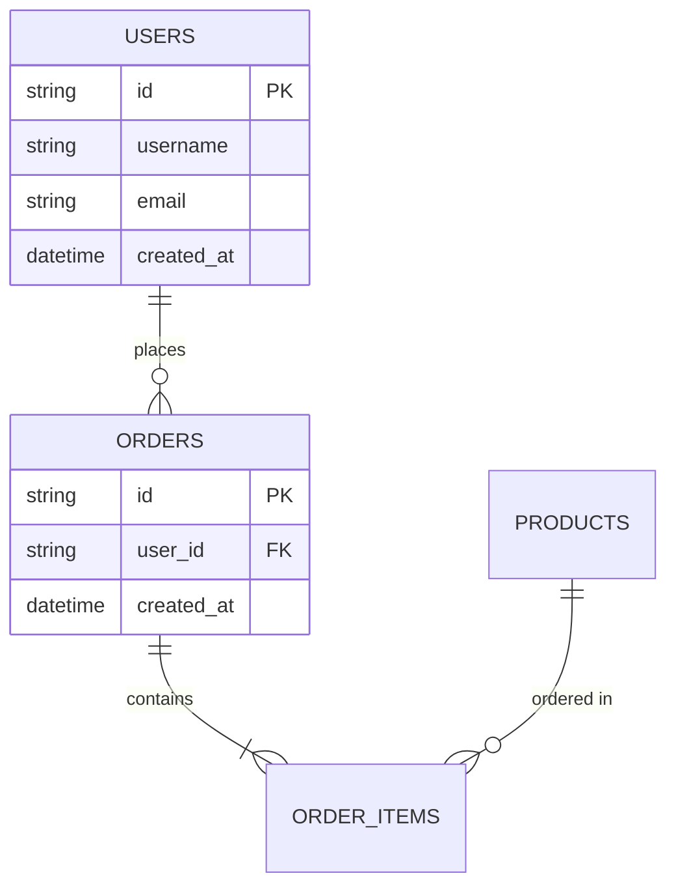

# 数据库设计

## 数据库选择

- **类型**: 关系型数据库（如 PostgreSQL / MySQL）
- **版本**: 
- **字符集**: UTF-8

## ER 图

使用 Mermaid 绘制 ER 图：

## 表结构设计

### users 用户表

| 字段名 | 类型 | 约束 | 说明 |
|--------|------|------|------|
| id | VARCHAR(36) | PK | 用户ID |
| username | VARCHAR(50) | UNIQUE, NOT NULL | 用户名 |
| email | VARCHAR(100) | UNIQUE, NOT NULL | 邮箱 |
| password_hash | VARCHAR(255) | NOT NULL | 密码哈希 |
| created_at | TIMESTAMP | NOT NULL, DEFAULT NOW() | 创建时间 |
| updated_at | TIMESTAMP | NOT NULL, DEFAULT NOW() | 更新时间 |

**索引**：
- `idx_username` ON (username)
- `idx_email` ON (email)

---

在这里添加你的表设计...

## 数据迁移策略

- 版本控制
- 回滚机制
- 数据备份
