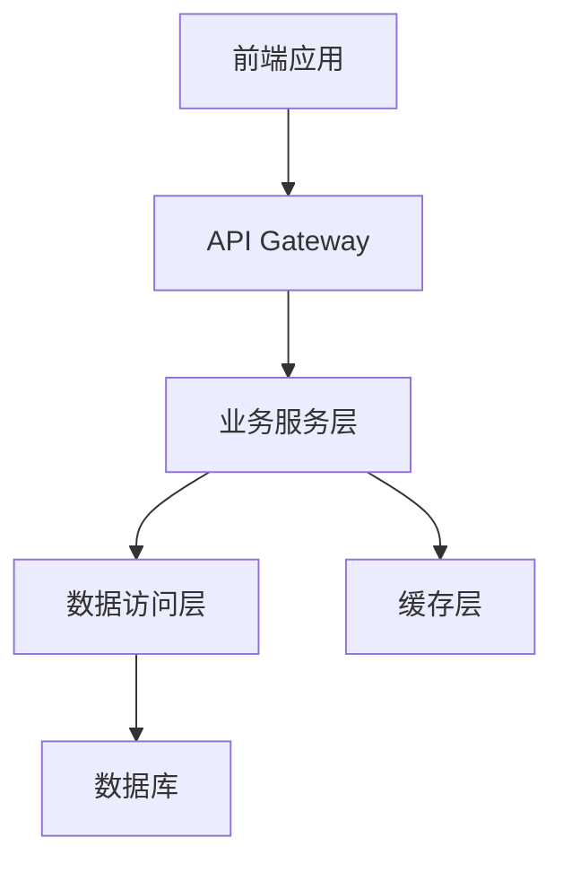

# 系统架构设计

## 整体架构

使用 Mermaid 绘制架构图：

## 技术栈

### 前端
- 框架：React + TypeScript
- UI组件：Ant Design Pro
- 状态管理：
- 路由：

### 后端
- 语言：Python / Node.js
- 框架：
- 数据库：
- 缓存：

### 基础设施
- 容器化：Docker
- 编排：Kubernetes
- CI/CD：

## 模块划分

### 核心模块
- `module1` - 描述
- `module2` - 描述

### 依赖关系

## 扩展点

列出系统的可扩展点和插件机制。
