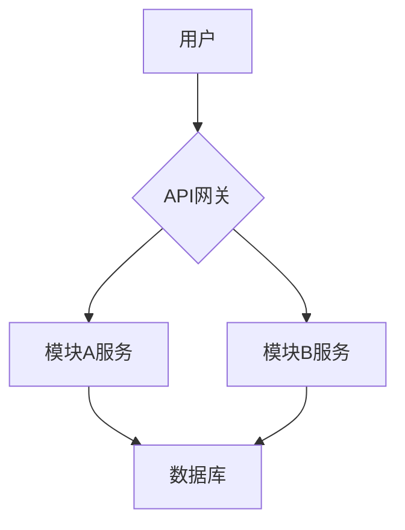

# 2. 总体技术架构

## 2.1 架构图

[使用 Mermaid 或其他图表工具，绘制项目的高层架构图，展示模块间的关系。]

## 2.2 技术栈选型

| 领域 | 技术 | 备注 |
| --- | --- | --- |
| 前端 | | |
| 后端 | | |
| 数据库 | | |
| 缓存 | | |
| CI/CD | | |

## 2.3 跨模块设计原则

- **通信协议**: [例如：所有内部服务间通信使用 gRPC。]
- **数据一致性**: [例如：关键业务采用分布式事务，非关键业务采用最终一致性。]
- **错误处理**: [定义统一的错误码和返回格式。]
