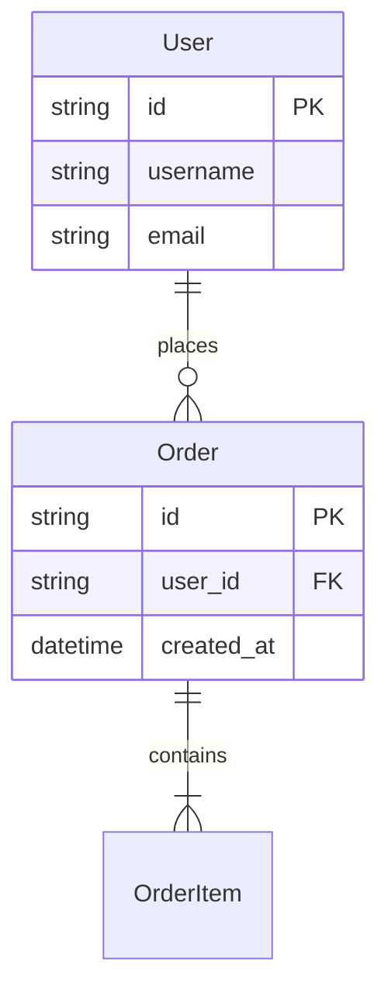

# 4. 数据库设计 (模块A)

## 4.1 ER 图

## 4.2 表结构

### users 表

| 字段名 | 类型 | 约束 | 说明 |
| --- | --- | --- | --- |
| id | VARCHAR(36) | PK | 用户ID |
| username | VARCHAR(50) | UNIQUE | 用户名 |
| email | VARCHAR(100) | UNIQUE | 邮箱 |
| created_at | TIMESTAMP | NOT NULL | 创建时间 |

### 索引

- idx_username ON users(username)
- idx_email ON users(email)

## 4.3 数据迁移

- 版本: v1.0
- 迁移脚本: [链接]
