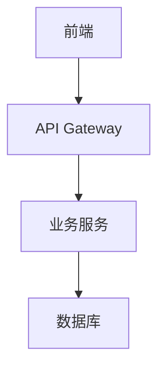

# DOC FIRST

## 文档优先的原生氛围编程（Vibe Coding）最佳实践

基于"文档工具+CLI+AI IDE"实现从需求文档出发到工程实现的端到端开发流程

---

## 🎯 核心理念

**文档即代码，文档即产品** - 通过结构化的文档驱动整个开发流程，让每个环节都有清晰的输入输出，实现真正的"文档优先"开发模式。

- 文档库：需要一个云端文档管理工具，可以是飞书文档、语雀等提供API接口的在线文档
- AI IDE：qoder、trae、cursor等
- 前后端框架：ant-design-pro + python、typescript

---

## 🚀 完整开发流程

### 1. 需求文档 (Requirements Documentation)
**目标**: 明确产品目标和用户需求

#### 1.1 用户故事 (User Stories)
- 使用 Markdown 格式编写用户故事
- 包含：角色、功能、价值三个要素
- 示例：
  ```markdown
  ## 用户故事
  - 作为用户，我希望能够快速搜索产品，以便找到我需要的商品
  - 作为管理员，我希望能够管理用户权限，以便控制系统访问
  ```

#### 1.2 功能需求 (Functional Requirements)
- 详细描述每个功能模块
- 包含输入、处理、输出描述
- 使用表格形式整理优先级

#### 1.3 非功能需求 (Non-functional Requirements)
- 性能要求
- 安全要求
- 可用性要求
- 兼容性要求

### 2. 设计文档 (Design Documentation)
**目标**: 将需求转化为技术实现方案

#### 2.1 系统架构设计
- 整体架构图 (使用 Mermaid 或 PlantUML)
- 技术栈选择
- 模块划分和依赖关系

#### 2.2 数据库设计
- ER 图设计
- 表结构定义
- 索引和约束设计

#### 2.3 API 设计
- RESTful API 规范
- 请求/响应格式定义
- 错误码和状态码规范

#### 2.4 安全设计
- 认证授权机制
- 数据加密策略
- 安全漏洞防护

### 3. 视觉交互 (Visual & Interaction Design)
**目标**: 定义用户界面和交互体验

#### 3.1 设计系统
- 色彩规范
- 字体规范
- 组件库定义
- 图标系统

#### 3.2 原型设计
- 线框图 (Wireframes)
- 高保真原型
- 交互流程图

#### 3.3 响应式设计
- 移动端适配
- 平板端适配
- 桌面端适配

### 4. 前后端实现 (Frontend & Backend Implementation)
**目标**: 将设计转化为可运行的代码

#### 4.1 开发环境搭建
- 项目初始化
- 依赖管理
- 开发工具配置

#### 4.2 后端开发
- API 实现
- 数据库操作
- 业务逻辑实现
- 单元测试

#### 4.3 前端开发
- 组件开发
- 状态管理
- 路由配置
- 样式实现

#### 4.4 集成测试
- API 集成测试
- 端到端测试
- 性能测试

---

## 🛠️ 推荐工具链

### 文档工具
- **Notion** - 协作式文档编辑
- **Obsidian** - 知识图谱式文档管理
- **GitBook** - 技术文档发布
- **Mermaid** - 图表绘制

### CLI 工具
- **create-react-app** / **Vite** - 前端项目初始化
- **Express Generator** / **Nest CLI** - 后端项目初始化
- **Prisma** - 数据库 ORM
- **Docker** - 容器化部署

### AI IDE
- **Cursor** - AI 驱动的代码编辑器
- **GitHub Copilot** - AI 代码助手
- **Tabnine** - 智能代码补全

---

## 📋 文档模板

### 需求文档模板
```markdown
# 项目需求文档

## 项目概述
- 项目名称：
- 项目目标：
- 目标用户：

## 功能需求
### 核心功能
1. 功能名称
   - 描述：
   - 优先级：高/中/低
   - 验收标准：

## 非功能需求
- 性能要求：
- 安全要求：
- 可用性要求：
```

### 设计文档模板
```markdown
# 系统设计文档

## 架构设计
### 整体架构


## 技术选型
- 前端：React + TypeScript
- 后端：Node.js + Express
- 数据库：PostgreSQL
```

---

## 🎯 最佳实践

### 1. 文档版本控制
- 使用 Git 管理文档版本
- 建立文档审查流程
- 保持文档与代码同步

### 2. 迭代式开发
- 每个迭代都从更新文档开始
- 文档变更需要团队评审
- 定期回顾和优化文档结构

### 3. 自动化集成
- 文档自动生成 API 文档
- 代码注释自动同步到文档
- 持续集成中集成文档检查

### 4. 团队协作
- 建立文档编写规范
- 定期进行文档评审
- 鼓励团队成员贡献文档

---

## 📚 相关资源

- [文档驱动开发指南](https://example.com)
- [API 设计最佳实践](https://example.com)
- [前端组件设计系统](https://example.com)
- [后端架构设计模式](https://example.com)

---

## 🤝 贡献指南

欢迎提交 Issue 和 Pull Request 来改进这个文档优先的开发流程！

1. Fork 本仓库
2. 创建特性分支
3. 提交更改
4. 发起 Pull Request

---

*最后更新：2024年*